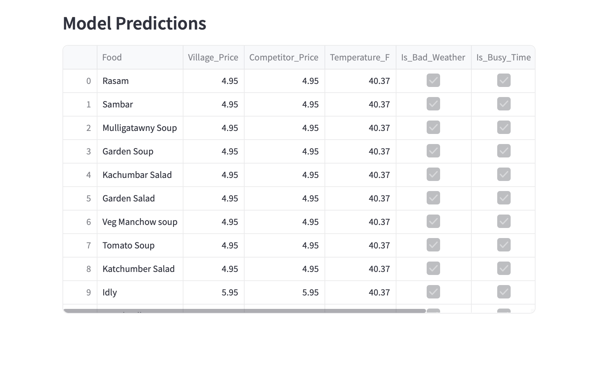

# Village Restaurant Price Predictor

This project is a **Streamlit** web app that predicts the adjusted price for items from **Village Restaurant** based on factors such as nearby restaurant prices, weather conditions, and busy times.

## Features
- Fetch restaurant details and menu from **Yelp** API.
- Scrape restaurant menus using **Selenium**.
- Predict menu prices based on current conditions using a machine learning model (**RandomForestRegressor**).

## Prerequisites

Before you run this project, you need to have **Python 3.x** installed on your machine.

### Libraries
The required libraries can be installed using the `requirements.txt` file provided.

```bash
pip install -r requirements.txt
```

You may visit the notebook attached to know the things in details.

### API Keys
You need to set up your own API keys for the following services:

**Yelp API** - for fetching restaurant data. <br> <br> 
**OpenWeatherMap API** - for weather data. <br> <br>

Set the API keys on **.env** file. The file must be on a root directory. Set it as
```python
YELP_API_KEY='your_api_key'
WEATHER_API_KEY='your_api_key'
```


## Run the Project

1. **Clone this repository to your local machine** <br> <br>
2. **Install the required libraries** 
    ```bash
    pip install -r requirements.txt
    ```
3. **Run the Streamlit app**
   
   ```
   streamlit run app.py
   ```
   

## Project Overview

### 1. Restaurant Data Fetching
   The app uses the Yelp API to fetch details of Village Restaurant. <br> <br> 
   It also scrapes menus of nearby restaurants using Selenium.
### 2. Price Prediction
The app predicts the adjusted price of menu items based on weather conditions and the analysis of nearby restaurant prices. <br> <br> 
The model uses RandomForestRegressor for making price predictions.

## Sample Snapshots

 <br> <br>
 <br> <br>
 <br> <br>
 <br> <br>
 <br> <br>
 <br> <br>
 <br> <br>


___